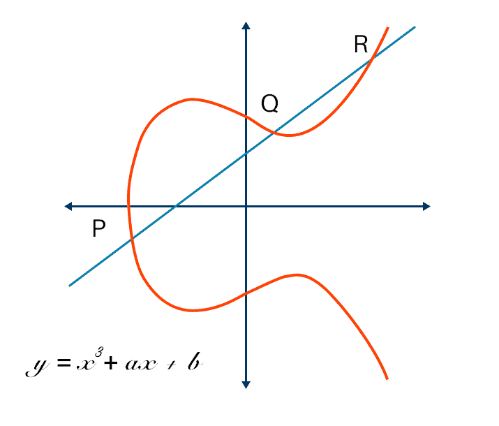

# **Kummer Isogeny**

Kho lưu trữ này chứa các lớp (classes) trong SageMath dành cho:
- `KummerLine`
- `KummerPoint`
- `KummerLineIsogeny`

---

## **1. Tổng quan**
- `KummerLine` là **đường Kummer** tương ứng với đường cong Montgomery $ C : y^2 = x(x^2 + A x + x)$.

- `KummerPoint` là **điểm trên đường Kummer**, tương ứng với tọa độ $x$ của một điểm trên đường cong Montgomery trong tọa độ $x$ theo dạng projective $ x(P) = (X : Z) $.

- `KummerLineIsogeny` được dùng để **tính toán hợp thành isogeny (đẳng cấu) giữa hai đường Kummer**.

---

### *1.1. Lý do sử dụng phép tính và isogeny chỉ dựa trên tọa độ $x$ (x-only)*

Có hai lý do chính để sử dụng phép toán và tính toán isogeny chỉ dựa trên tọa độ $x$:

1. *Nhanh hơn (Fast):* Việc sử dụng công thức chỉ dựa trên $x$ giúp tăng hiệu quả tính toán đáng kể. Ví dụ, có thể đạt tốc độ nhanh hơn từ **5 đến 25 lần** so với việc sử dụng các công thức isogeny mặc định trong SageMath.

2. *Hỗ trợ nhiều điểm xoắn hữu tỉ hơn (More Torsion):* Làm việc với isogeny chỉ dùng $x$ giúp ta truy cập được các **điểm xoắn hữu tỉ (rational torsion points)** trên cả **đường cong elliptic** và **đường cong bậc hai (quadratic twist)** của nó. Kỹ thuật này được sử dụng, chẳng hạn, trong giao thức [SQISign](https://eprint.iacr.org/2020/1240).

---

### *1.2. Hạn chế của công thức x-only*

Tuy nhiên, công thức chỉ dựa trên $x$ không phải lúc nào cũng phù hợp. Vấn đề lớn nhất là ta **mất đi cấu trúc nhóm**.

- Trên một **đường cong elliptic**, ta có thể luôn tính được $ P + Q $ nếu biết hai điểm $ P, Q $. Nhưng trên **đường Kummer**, ta **chỉ có thể tính được** $ x(P+Q) $ **nếu biết đủ ba giá trị**:
  $$
  x(P), \quad x(Q), \quad x(P-Q)
  $$
- Bằng cách lấy căn bậc hai, ta có thể khôi phục tọa độ $ y $ để thu được $ P $ *hoặc* $ -P $. Tuy nhiên, để xác định đúng dấu, ta cần thêm thông tin khác. Tương tự, khi tính toán $\phi(xP)$ bằng lớp `KummerLineIsogeny`, ta chỉ có thể đánh giá **ảnh của tọa độ x**, chứ không thể xác định đầy đủ điểm $ P $.

---

## **2. Các lớp trong Kummer Isogeny**

Các lớp `KummerLine` và `KummerPoint` đơn giản là phần triển khai phép tính **x-only arithmetic trên đường cong Montgomery**, được đóng gói gọn gàng và dễ sử dụng. Chi tiết của các lớp này được mô tả thêm trong phần chú thích của mã nguồn.\
Lớp `KummerLineIsogeny` hiện thực các thuật toán nổi tiếng sau:
- ***Craig Costello & Huseyin Hisil:*** *[A simple and compact algorithm for SIDH with arbitrary degree isogenies](https://ia.cr/2017/1198)*  \
→ Áp dụng cho **isogeny bậc nhỏ và lẻ** ($ \ell $ nhỏ, lẻ).

- ***Joost Renes:*** *[Computing Isogenies between Montgomery Curves Using the Action of (0, 0)](https://ia.cr/2017/1198)* \
→ Dành cho **isogeny bậc 2**.

- ***Michael Meyer & Steffen Reith:*** *[A faster way to the CSIDH](https://ia.cr/2018/782)* \
→ Sử dụng mẹo chuyển sang **twisted Edwards curves** để tính nhanh hơn miền đích (codomain).

- ***Daniel J. Bernstein, Luca De Feo, Antonin Leroux, Benjamin Smith:*** *[Faster computation of isogenies of large prime degree](https://velusqrt.isogeny.org/)*  
  → Áp dụng **công thức VeluSqrt** cho các **isogeny bậc nguyên tố lớn** ($ \ell $ lớn).

---
